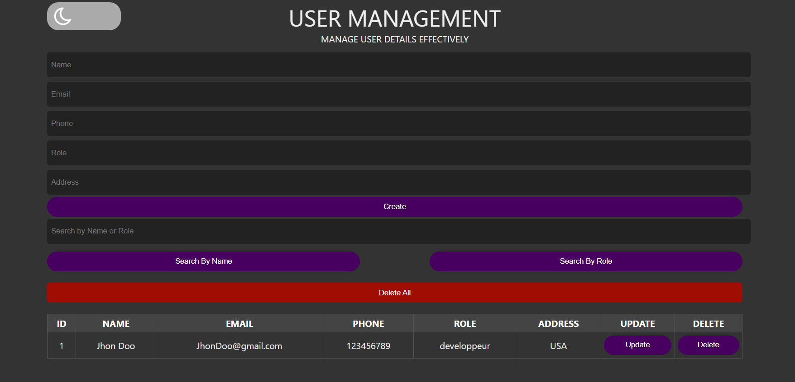
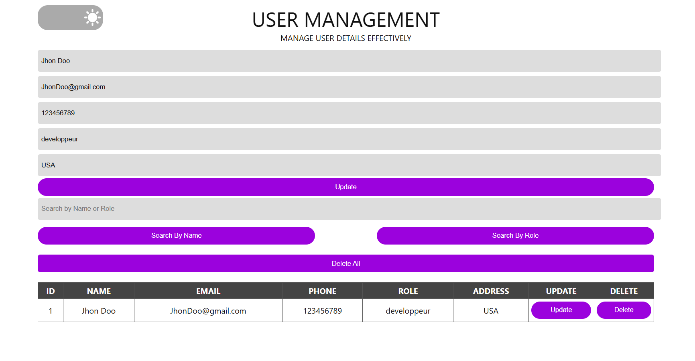

# user-management
## Project Description
This User Management System is a web application that allows users to manage a list of users by performing CRUD (Create, Read, Update, Delete) operations. The application features light/dark mode toggling, search functionality, and data persistence using Local Storage.

